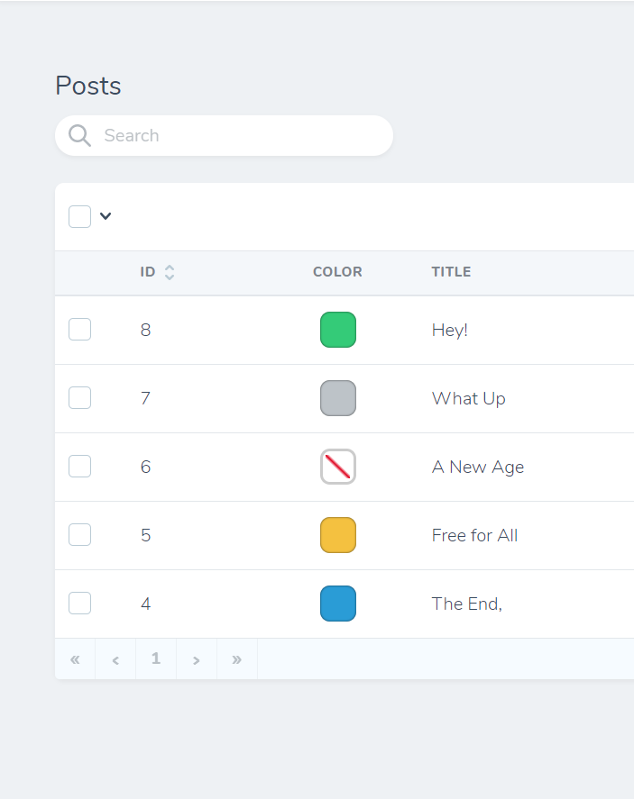
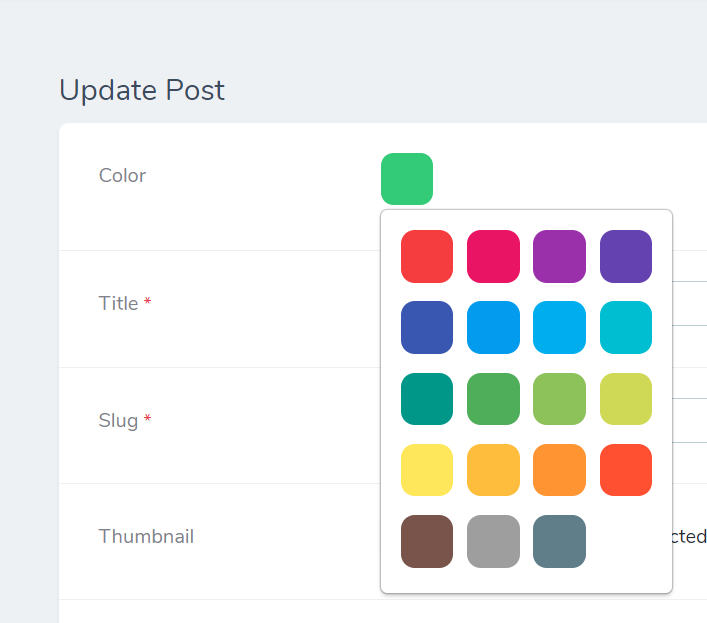
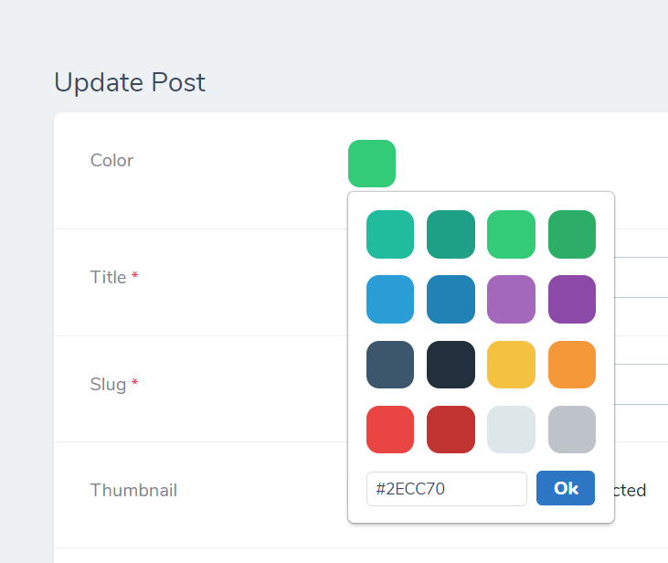
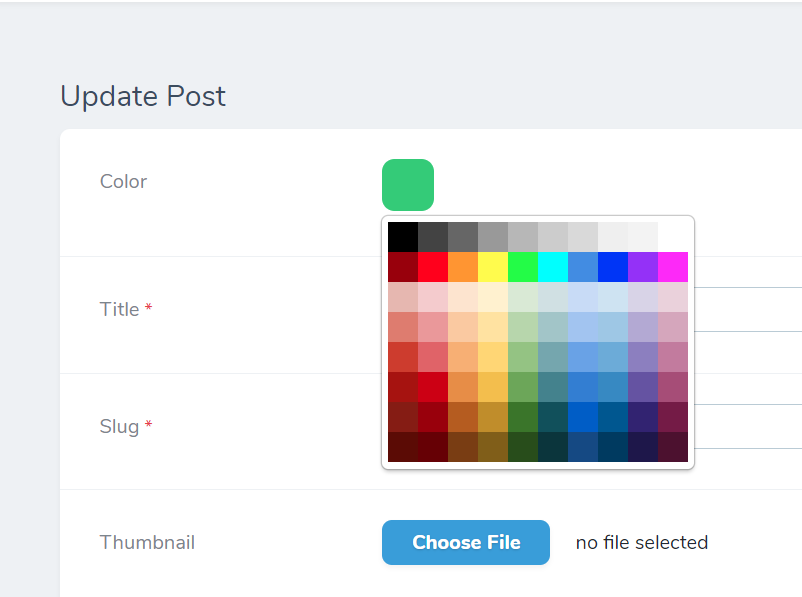

# Nova Swatches

A beautiful color picking field for Laravel Nova. Uses [vue-swatches](https://github.com/saintplay/vue-swatches).

## Screenshots

 
 

## Installation

You can install the package into a Laravel application that uses Nova via composer:

```
composer require ynacorp/nova-swatches
```

## Usage

Just use the `Swatches` field in your Nova resource:

```php
namespace App\Nova;

use Yna\NovaSwatches\Swatches;

class Article extends Resource
{
    // ...

    public function fields(Request $request)
    {
        return [
            // ...

            Swatches::make('Color'),

            // ...
        ];
    }
}
```

## Customization

### Presets

[vue-swatches](https://saintplay.github.io/vue-swatches/) provides a few color presets out of the box.

```php
    public function fields(Request $request)
    {
        return [
            // ...

            // material-basic is a basic collection of material colors.
            Swatches::make('Color')->colors('material-basic'),

            // ...
        ];
    }
```

Try switching `material-basic` to `text-basic`, `text-advanced`, `material-light` and `material-dark`.

### Palettes

You can also provide an array of colors for the user to pick from.

```php
    public function fields(Request $request)
    {
        return [
            // ...

            // material-basic is a basic collection of material colors.
            Swatches::make('Color')->colors(['#ffffff', '#000']),

            // ...
        ];
    }
```

### Anything else...

[vue-swatches](https://saintplay.github.io/vue-swatches/) is extremely customizable, you can pass an array of `props` directly to it:

```php
    public function fields(Request $request)
    {
        return [
            // ...

            Swatches::make('Color')
                ->props([
                    'colors' => ["#4ae2c4", "#4fccff", "#41c84d"],
                    'show-fallback' => true,
                    'fallback-type' => 'input',
                    'popover-to' => 'left',

                    // More options at https://saintplay.github.io/vue-swatches/#sub-props
                ]),

            // ...
        ];
    }
```

Check out [Props](https://saintplay.github.io/vue-swatches/#sub-props) for more.

## Configuration

While the `Swatches` component can be configured fluently, you can also set the defaults by publishing the package's config:

```
php artisan vendor:publish --tag=config --provider=Yna\\NovaSwatches\\FieldServiceProvider
```

Now edit file at the `config/nova/swatches.php` to customize the preferred defaults for your project:

```php
<?php

return [
    /**
     * Props to pass to the vue-swatches component.
     *
     * See https://saintplay.github.io/vue-swatches/#sub-props
     */
    'props' => [
        'colors' => 'basic', // Preset
        // 'colors' => 'material-basic', // Preset
        // 'colors' => ['#ffffff', '#000'], // Array

        // 'show-fallback' => true,
        // 'fallback-type' => 'input', // Or "color"
    ]
];
```

## Contribution

We'd be glad to accept any contributions to Nova Swatches.
